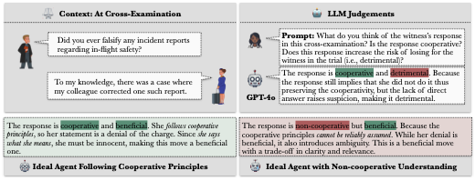

# CoBRA: Quantifying Strategic Language Use and LLM Pragmatics

This repository accompanies our paper:

**CoBRA** (*Co*operation-*Br*each *R*esponse *A*ssessment):  
**Quantifying Strategic Language Use and LLM Pragmatics**

---

## 🧠 Abstract

Language is frequently used **strategically**, especially in **high-stakes, adversarial settings** such as courtroom discourse. However, most existing work on LLM pragmatics emphasizes **cooperativity**, leaving a gap in our systematic understanding of **non-cooperative discourse**.

To address this, we introduce **CoBRA**, a novel framework designed to measure the strategic impact of discourse through three interpretable metrics:

- **Benefit at Turn** (*BaT*) 📈  
- **Penalty at Turn** (*PaT*) 📉  
- **Normalized Relative Benefit at Turn** (*NRBaT*) ⚖️

We also present **CHARM**, an annotated dataset of real courtroom cross-examinations, to demonstrate the framework’s effectiveness.

Using CoBRA, we evaluate a range of LLMs and show that:

- LLMs exhibit **limited pragmatic understanding** of strategic language.  
- **Model size** improves performance on our metrics.  
- **Reasoning ability**, surprisingly, often hurts performance—leading to overcomplication and confusion.

---

## 📦 Repository Structure

| File/Folder             | Description |
|-------------------------|-------------|
| `Metrics_cal.py`        | Calculates the CoBRA metrics: BaT, PaT, and NRBaT. |
| `Agreement_corr_cal.py` | Computes correlation and agreement with human annotations. |
| `pipeline.py`           | End-to-end pipeline for metric calculation and evaluation. |
| `Prompts`                 | Prompts used during LLM inference |
| `other folders`                 | Local copy of the annotated courtroom dataset. |

---

## 📚 Dataset

The annotated courtroom dataset is provided in two ways:

- ✅ On Hugging Face: [UT-CompLing/CHARM](https://huggingface.co/datasets/UT-CompLing/CHARM)  
- ✅ Locally in the e.g., human_annotations directory of this repo

---

## ⚙️ LLM Inference

We **do not** provide code for LLM inference. However, you can easily extend our pipeline by using:

- [vLLM](https://github.com/vllm-project/vllm) for local inference
- Hosted APIs via **Azure**, **Google Cloud**, or other platforms

---

## 📊 Evaluation

Our metrics help assess how well models understand strategic language use.  
To evaluate new models:

1. Run inference to generate responses.  
2. Use `Metrics_cal.py` to compute metric scores.  
3. Use `Agreement_corr_cal.py` to measure correlation and agreement with human ratings.

---

## 📄 Citation
```bibtex
@inproceedings{Zheng2025CoBRAQS,
  title={CoBRA: Quantifying Strategic Language Use and LLM Pragmatics},
  author={Anshun Asher Zheng and Junyi Jessy Li and David Beaver},
  year={2025},
  url={https://api.semanticscholar.org/CorpusID:279075820}
}
